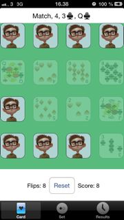
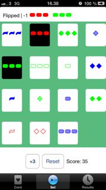
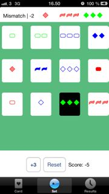
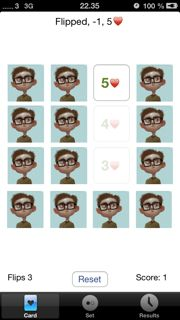
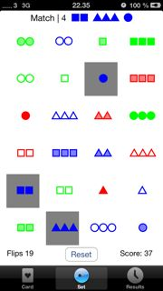
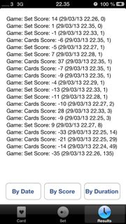

s111023
=======
##Assigment 3

	Have done only the required tasks.
	
1. ~~Create an application that plays both the Set game (single player) in one tab and the Playing Card matching game in another.~~
2. ~~You must use polymorphism to design your Controllers for the two games (i.e. you
must have a (probably abstract) base card game Controller class and your Set game
and Playing Card game Controllers must be subclasses thereof).~~
3. ~~For Set, 12 cards should be initially dealt and Set cards should always show what’s on
them even if they are technically “face down”. For the Playing Card game deal 22
cards, all face down.~~
4. ~~The user must then be able to choose matches just like in last week’s assignment.~~
5. ~~When a Set match is successfully chosen, the cards should be removed from the game (not just blanked out or grayed out, but actually removed from the user-interface and the remaining cards rearranged to use up the space that was freed up in the userinterface).~~
6. ~~Set cards must have the “standard” Set look and feel (i.e. 1, 2 or 3 squiggles, diamonds or ovals that are solid, striped or unfilled, and are either green, red or purple). You must draw these using Core Graphics and/or UIBezierPath. You may not use images
or attributed strings. Use the PlayingCardView from the in-class demo to draw your
Playing Card game cards.~~

7. ~~In the Set game (only), the user must always have the option somewhere in the UI of
requesting 3 more cards to be dealt at any time if he or she is unable to locate a Set.~~

8. ~~Automatically scroll to show any new cards when you add some in the Set game.~~

9. ~~Do something sensible when no more cards are in the deck and the user requests
more.~~


10. ~~If there are more cards than will fit on the screen, simply allow the user to scroll down
to see the rest of the cards. Pick a fixed (and reasonable) size for your cards and keep
them that size for the whole game.~~
11. ~~It is very important that you continue to have a “last flip status” UI and that it show
not only matches and mismatches, but also which cards are currently selected (because
there can be so many cards now that you have to scroll to get to all the cards in a
match). A UILabel may no longer be sufficient for this UI.~~


12. ~~The flip counter can be removed from the game. You must still show the score,
however.~~


13. ~~The user should still be able to abandon the game and start over with a fresh group of
cards at any time (i.e. re-deal).~~


14. ~~The game must work properly (and look good) in both Landscape and Portrait
orientations on both the iPhone 4 and the iPhone 5. Use Autolayout to make this
work (not struts and springs).~~

---
##Assigment 2

	Please use retina 4 inch to view otherwise tab will occlude score, flip labels and reset button!

###Required Tasks

1. ~~Add a tab bar controller to your application. One tab will be the game you built last
week in Assignment 1. The other tab will be a new game, Set. Set is still a card
game, so a good solution to this assignment will use object-oriented programming
techniques to share a lot of code.~~ 

2. ~~Don’t violate any of the Required Tasks from Assignment 1 in the playing card game
tab (in other words, don’t break any non-extra-credit features from last week). The
only exception is that your playing card game is required to be a 2-card-match-only
game this week, so you can remove the switch or segmented control you added for
Required Task #5 in Assignment 1. Your Set game is a 3-card matching game.~~
3. ~~The Set game only needs to allow users to pick sets and get points for doing so (e.g. it
does not redeal new cards when sets are found). In other words, it works just like
your other card game (except that it is a 3 card (instead of 2 card) match with
different kinds of cards)~~

4. ~~Choose reasonable amounts to award the user for successfully finding a set (or
incorrectly picking cards which are not a set).~~

5. ~~Your Set game should have 24 cards.~~


6. ~~Instead of drawing the cards in the classic form (we’ll do that next week), we’ll use
these three characters ▲ ● ■ and use attributes in NSAttributedString to draw
them appropriately (i.e. colors and shading).~~


7. ~~Your Set game should have a Deal button, Score label and Flips label just like your
playing card matching game from Assignment 1 does.~~


8. ~~Your Set game should also report (mis)matches like Required Task #3 in Assignment 1, but you’ll have to enhance this feature (to use NSAttributedString) to make it
work for displaying Set card matches.~~

###Extra 


1. ~~Create appropriate icons for your two tabs. The icons are 30x30 and are pure alpha
channels (i.e. they are a “cutout” through which the blue gradient shines through).
Search the documentation for more on how to create icons like that and set them.~~
2. ~~Add third tab to track the user’s scores. It should be clear which scores were playing
card match games and which scores were Set card match games.~~

---

